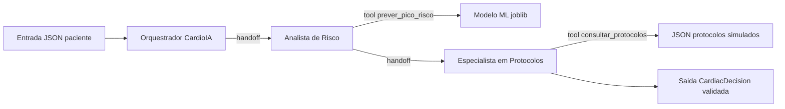

# Documentação — Parte 2 (sistema multiagente) · máx. 3 páginas (fonte para PDF)

**Projeto:** CardioIA — Fase 6 · **Grupo 34**

## 1. Diagrama simplificado da arquitetura



Fluxo lógico: o **Orquestrador** delega via **handoff** ao **Analista de Risco**, que executa a *tool* de inferência sobre o artefato persistido; em seguida o analista transfere ao **Especialista em Protocolos**, que consulta a base simulada e emite a **resposta estruturada** (`CardiacDecision`) com validação Pydantic (structured output do Agents SDK).

## 2. Papel de cada agente

| Agente | Função |
|--------|--------|
| **Orquestrador CardioIA** | Ponto de entrada; garante delegação por handoff ao analista de risco e preserva o contexto conversacional. |
| **Analista de Risco** | Extrai features do JSON do paciente, chama a *tool* `prever_pico_risco_cardiaco` (integração com o modelo) e encaminha ao especialista em protocolos. |
| **Especialista em Protocolos** | Cruza `classificacao_risco` e SpO2 com a base `data/protocolos_medicos.json` via *tool* `consultar_protocolos_medicos` e produz a decisão final estruturada. |

## 3. Handoffs e tools

- **Handoffs:** implementados como ferramentas geradas pelo SDK (`transfer_to_*`), conectando Orquestrador → Analista → Especialista. O histórico de mensagens acompanha a cadeia, permitindo auditoria e rastreio.  
- **Tools:** funções Python anotadas com `@function_tool` — predição ML e consulta de protocolos — com esquemas explícitos nos docstrings para o modelo.  
- **Validação de saída:** o Especialista define `output_type=CardiacDecision`, garantindo campos obrigatórios: probabilidade, classificação em quatro níveis e lista de protocolos.

## 4. Exemplo real de entrada e saída (trecho de log)

**Entrada (resumo):**

```json
{"idade": 72, "freq_cardiaca": 118, "spo2": 88, "carga_sistema": 82, "disponibilidade_recursos": 35}
```

**Saída estruturada (ilustrativa — valores dependem do modelo e do LLM):**

```json
{
  "probabilidade_pico_risco": 0.79,
  "classificacao_risco": "critico",
  "protocolos_sugeridos": [
    "Monitorização invasiva/avançada conforme recursos",
    "Reforço de oxigenoterapia / reavaliação respiratória urgente (gatilho SpO2)"
  ],
  "notas": "Coerência verificada entre SpO2 limítrofe e reforço de suporte respiratório nos protocolos."
}
```

**Vídeo (≤3 min, YouTube não listado):** link no `README.md` do repositório.
